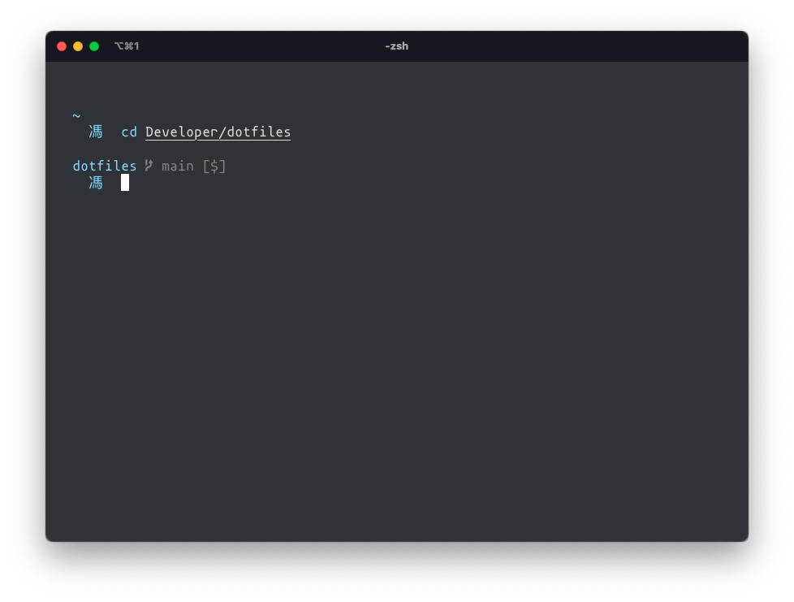

# max's dotfiles

A dotfile repo that exists to make it easier for me to bootstrap onto new systems. Nothing special, really. It is notably free of Oh-My-Zsh, which is atypical of most zsh configurations, and has a variety of aesthetic and quality of life tweaks and improvements that I enjoy in my daily work. Please feel free to use any of these files or take some inspiration from them for your own dotfiles.

## Notable Features

- Automated cloud synchronization with `sync` command - downloads only
- Automated SSH configuration with `sshx` command
- **Minimalist Zsh prompt** using Spaceship with fully customized iTerm client
- Hotkey window with `Option + Space`, zsh auto-suggestion completion with `Ctrl + Space`, and directory completion with `Tab`
- Extensively customized `.zshrc` with custom aliases, scripts, auto-suggestions, tab completion, syntax highlighting, and iTerm integration
- Custom `.gitconfig` with custom aliases, colors, **git-delta**, and more
- Python development tools and custom `.pythonrc` shell
- `~/.local` directory for housing company-specific scripts
- Establishes configs and symlinks in the home directory at `~/.config`, routing most logs into `~/.cache`
- Bootstrapped application and dependency installations with Brewfile

## Scripts

### `sync`

Run to synchronize dotfiles from the repo to `$HOME` and refresh the Brewfile. Can install dotfiles as well as maintain any updates.

#### Dependencies
* macOS
* Homebrew
* Apple Developer Tools

Execute `sync` for the first time with `curl https://raw.githubusercontent.com/mxfng/dotfiles/main/sync | zsh` to install dotfiles. Afterward just run the command `sync` to keep dotfiles updated.

### `sshx`

Run to configure SSH authorization. Paired with the included SSH `config` file, `sshx` manages four different accounts: GitHub for personal and work, and GitLab for personal and work. The script will prompt the user to enter account information and instruct them on how to add SSH keys to the supported services, GitHub and GitLab.

### `title`

Easily rename tabs in your terminal by typing `title <your-title>`.

### `gpt`

Quickly triggers ChatGPT in the default web browser when `gpt` is executed.

## Installation

1. Install Homebrew using `/bin/bash -c "$(curl -fsSL https://raw.githubusercontent.com/Homebrew/install/HEAD/install.sh)"`
2. Install Apple Developer tools
3. Open up Terminal and close all other applications (if they will be upgraded by the Brewfile).
4. Run `curl https://raw.githubusercontent.com/mxfng/dotfiles/main/sync | zsh` in your Terminal.
5. Close Terminal and open up iTerm2.
6. To sync iTerm2 preferences with this repo, do the following:
   1. Go to Preferences > General > Preferences and check **load preferences from a custom folder or URL**, then click cancel on the popup to type the URL in manually. Set the directory to `~/Developer/dotfiles/.config/iTerm2`
7. Open **System Preferences** > Users & Groups > Login Items and make sure that **iTerm** is added and **Hide** is selected.
8. Fully quit iTerm2 by pressing `cmd + Q`, wait a moment, then reopen it for the repo preferences to load properly.

### Included Packages

- Core: `zsh`, `git`, `coreutils`, `asdf`
- Python: `python`, `pipx`
- Database: `sqlite3`, `postgresql`
- Tools: `spaceship`, `lf`, `zsh-syntax-highlighting`, `zsh-autosuggestions`, `git-delta`, `fzf`
- Languages: Python, Ruby, Kotlin, JavaScript/TypeScript
- Software: Alfred, Arc, Firefox, Google Chrome, Mononoki Nerd Font, iTerm2, Spotify, VSCode, Dropbox, Gimp, Inkscape, Slack, Discord, Postman, HTTPie

## Local Scripts

The `.zshrc` in this dotfiles repo creates a directory structure `~/.local/bin/$USER/` which is used to source scripts that are locally saved and not stashed in the cloud. I typically use this local directory to store scripts for development workflows pertaining to my current job, as they may contain sensitive information or hyper-specific scripts.

- Create a local script using the command `touch ~/.local/bin/$USER/your_script`
- Ensure that this script is not hidden (preceded by a `.` character), as the `.zshrc` cannot source hidden files in this directory
- The `.zshrc` file sources files at the top level and all subdirectories of the `$USER` folder

## Aliases

- `h` - Returns the user to the home directory and clears the console
- `rm` - Performs a removal operation with the `-iv` flag
- `cp` - Performs a copy operation with the `-iv` flag
- `mv` - Performs a rename operation with the `-iv` flag
- `bc` - Opens the precision calculator with the `-ql` flag
- `mkd` - Creates a directory with the `-pv` flag
- `rmd` - Removes a directory recursively using the `-rf` flag
- `x86` - Runs script commands via Rosetta with `arch -x86_64`
- `ls` - Lists files in a directory with the `--color=auto` flag
- `la` - Lists all files in a directory, including hidden files, with `ls -a`
- `e` - Opens the preferred editor, defaulting to VSCode, via `$EDITOR`
- `cdev` - Opens the configured development folder via `$DEV`
- `cdot` - Opens the local directory for this repo on your machine
- `python` - Defaults to `python3`
- `pip-user` - Triggers global pip with `PIP_REQUIRE_VIRTUALENV=false python3 -m pip`
- `poop` - just for fun
- Reference `.gitconfig` for git command aliases